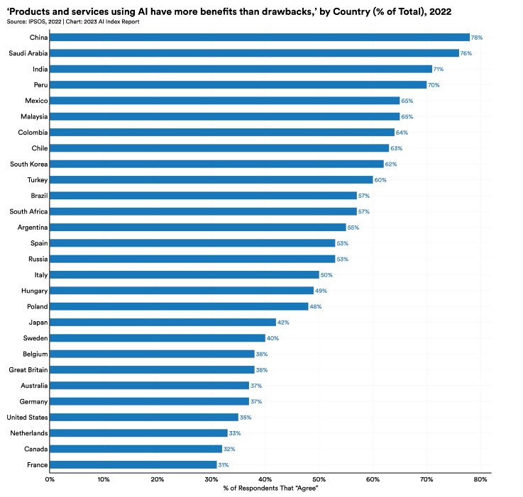
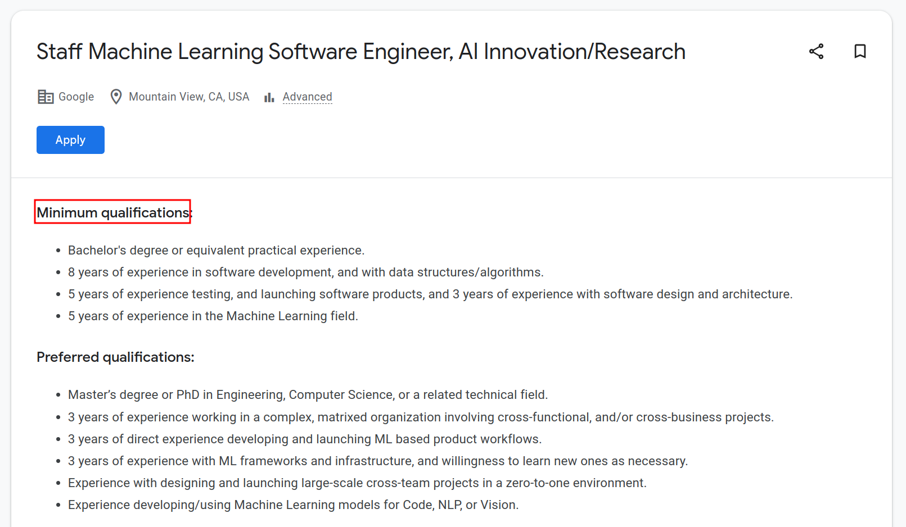

% title: The Illusion of "AI"
% type: post
% date: 2024-07-25
% description: Breaking the Herd Mentality
% tags: ai,thoughts,trends

## The Pipe Dream

Today, Artificial Intelligence has become the "dream job" for most people in the tech landscape, the golden ticket. The allure of these jobs fosters a sense of elitism, as many individuals feel privileged to be part of a field that promises innovation and influence, often overlooking the hard work and challenges that underpin such roles.

As in Plato's *Allegory of a Cave* most people see only a fascade of what AI jobs really are. They're mesmerized by the glamour and oblivioud to the gritty, mundane reality that's often the case.

## The epidemic of Buzzwords

Pop culture and media have romanticized the idea of AI. Words like *neural networks*, *LLM*s, *Deep Learning* roll off the tongues of people who more often than not don't really know what they are. They're sold a very sweet and tender idea about the field making many unsuspecting newbies flock towards it thinking that they have genuine interest in the field.

> "We seldom realize, for example, that our most private thoughts and emotions are not actually our own. For we think in terms of languages and images which we did not invent, but which were given to us by our society."
> *Wise Guy*

Youtube and the interwebs are filled with questionanble figures posing as teachers who claim to teach your hot topics in a span of weeks. What you must decide is, is this what *you* want, or are you pushing yourself into it because of all the buzz and chatter.

## The <del>Reality</del>

For those who actually break into the field, the day-to-day grind is often far removed from the Hollywood image of genius innovators. A typical datascience job involves data-wrangling: cleaning messy datasets, labelling samples and debugging.

Its often far less *exciting* than advertised and some people are shocked to find out that their dream job is to stare at hours of logs.

A large part of this hype stems from the *FOMO*, the fear of missing out on the "latest trends", cuz' ride the AI wave lest you're left behind.

This study by [Stanford](https://aiindex.stanford.edu/ai-index-report-2023/)(check it out!) clearly shows the favourable nature different countries are looking at AI as a concept.

## The Hiring Mirage

Your talent means nothing to recruiters(*mostly*). Let's break this down:

Recruiters often look at experience in years as opposed to evaluating the depth of skills and true problem-solving ability, missing out on talented individuals who may have honed their expertise in unconventional ways or shorter timeframes.

This evolves into a talent gap, where *perfect fits* are chosen based on time invested in a field rather than the ability to adapt and evolve in the tumultuous field.

## The Education Dilemma

Teaching ML right is *hard* (Trust me I've done it 😉). It takes a lot of patience and time to actually provide any value. Many courses and resources promise to make machine learning "easy" or "quick," but true mastery of ML is neither of those things. To genuinely provide value to students, educators must spend time addressing the fundamentals and resist the temptation to skip straight to trendy topics.

It’s easy to overwhelm beginners with advanced algorithms, flashy tools, and buzzwords without a strong foundation. Real learning in ML involves understanding math, statistics, and coding basics. The most valuable instructors take the time to break down each concept, relate it to real-world examples, and foster a hands-on approach, guiding students through the inevitable frustrations that come with building models from scratch, tuning parameters, and debugging.

## Conclusion...

This was a rant post in response to seeing a lot of people around me jumping on the hype-train without actually knowing what it entails. In no way am I discouraging anyone from exploring the field, but aim to defog your eyes on certain misconceptions.
